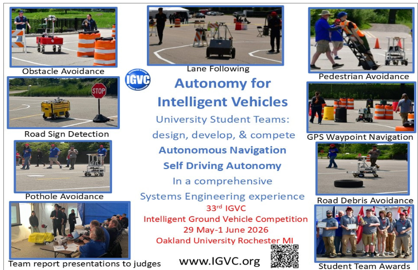
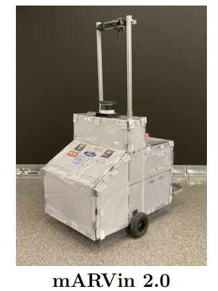
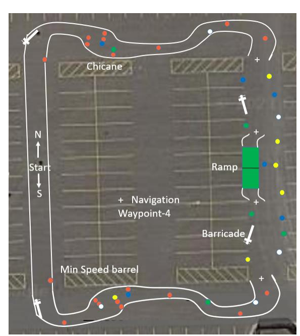
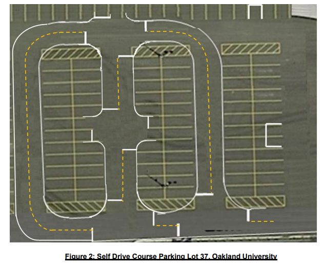

# Introduction to IGVC

## What is IGVC?
The Intelligent Ground Vehicle Competition (IGVC) is an annual event that challenges students to design and build autonomous ground vehicles. The competition focuses on the integration of robotics, ML, and engineering principles to navigate a course with various obstacles and tasks. 

This is the competition we spend the year preparing for, and it is the culmination of our efforts in ARV!

## mARVin

This is mARVin, our autonomous vehicle.

## The Events
### AutoNav
In AutoNav, mARVin has to navigate several obstacles while staying in track limits and within the given time. Learn more about the AutoNav event on page 9 [here](http://www.igvc.org/2026rules.pdf).

### Self-Drive
In Self-Drive, mARVin has to learn and follow the rules of the road. This competition has stop lines, lane keeping, and more. Learn more about the Self-Drive event on page 16 [here](http://www.igvc.org/2026rules.pdf).

