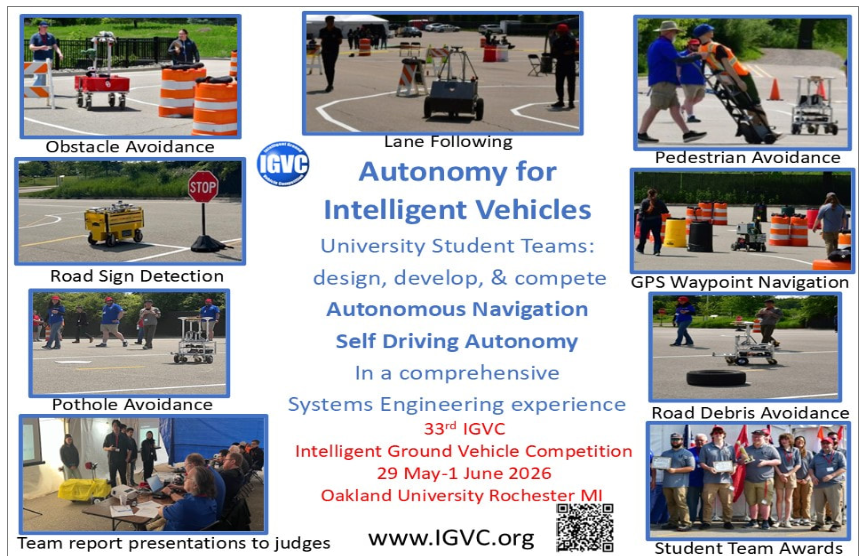
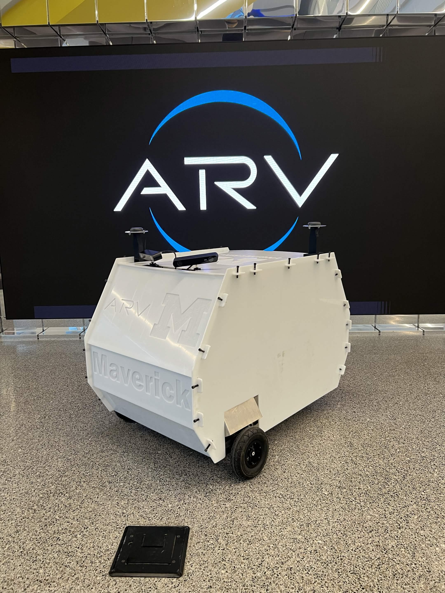
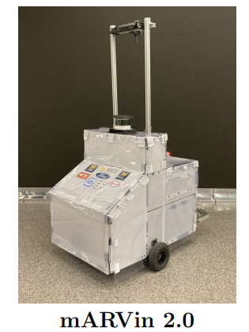
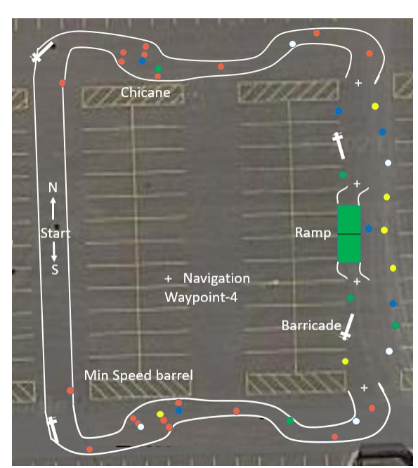
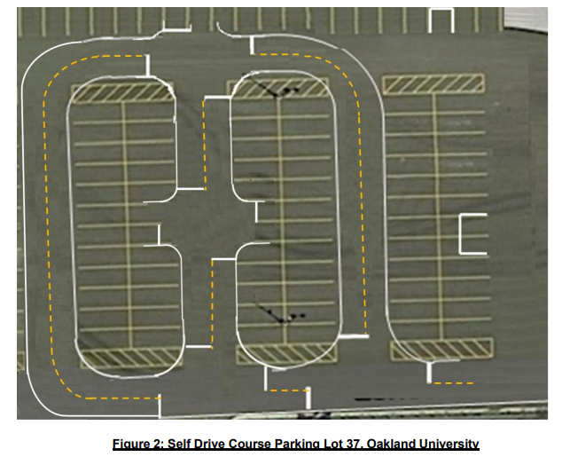

# Introduction to IGVC

## What is IGVC?

The Intelligent Ground Vehicle Competition (IGVC) is an annual event that challenges students to design and build autonomous ground vehicles. The competition focuses on the integration of robotics, ML, and engineering principles to navigate a course with various obstacles and tasks. 

This is the competition we spend the year preparing for, and it is the culmination of our efforts in ARV!

# Maverick
This is maverick, our current vehicle\

## mARVin

This is mARVin, a previously autonomous vehicle.

# Events : 

### AutoNav

In AutoNav, our robot has to navigate several obstacles while staying in track limits and within the given time. Learn more about the AutoNav event on page 9 [here](http://www.igvc.org/2026rules.pdf).

Auto-nav Map : \

### Self-Drive

In Self-Drive, our robot has to learn and follow the rules of the road. This competition has stop lines, lane keeping, and more. Learn more about the Self-Drive event on page 16 [here](http://www.igvc.org/2026rules.pdf).

Example of Computer Vision work done in self drive : \
Occupancy Grid Fusing\
We set goal waypoints that the Navigation team processes to move our robot there. Examples of things we make waypoints for are : 
\
Stopping for stop signs\
Parallel parking \
Lane Changing

Self-drive Map :\

