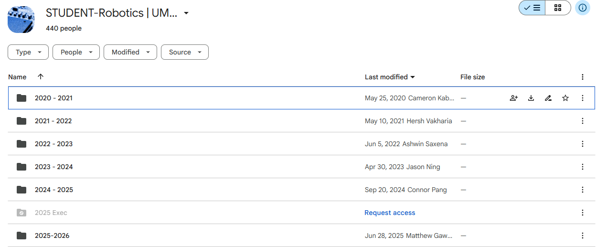

# 💾 Storage Guidelines

Efficient storage and organization are **critical** for smooth teamwork.  
At UMARV, we use two main platforms:

---

## 📂 Dropbox

🔑 **Purpose:** Storing large files that cannot easily live in Google Drive.  
Examples:
- Pretrained **model weights** (YOLO, CNNs, etc.)
- Large **datasets** (images, video recordings from the car)
- **Simulation outputs** or logs

👉 **Action:**  
Make sure you request **access to the UMARV Dropbox** from Maya or Pranav.  
This is where you’ll upload or download any big files needed for experiments.

---

## 📑 Google Drive

🔑 **Purpose:** Central hub for team documentation and collaboration.  
Examples:
- Meeting notes
- Design **slides**
- Project **documentation**
- Shared **sheets** for planning or experiments

👉 **Action:**  
Get access to the **UMARV Google Drive** as soon as you join.  
This will be your go-to place for staying up-to-date on project materials.

---

## ✅ Key Takeaways
- Use **Dropbox** for *heavy data* (models, images, videos).  
- Use **Google Drive** for *lightweight collaboration* (docs, slides, sheets).
- If you don’t yet have access, **ask Maya or Pranav right away** — it’s the first step to being productive on the team.

