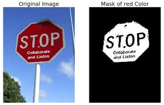

# 🎨 HSV Filtering

## Introduction

In autonomous robotics, vision systems often need to **detect objects of specific colors** — for example:
- Detecting **orange traffic cones** as obstacles.
- Recognizing **lane lines** painted in white or yellow.
- Identifying **colored markers** during navigation.

Working directly with **RGB (Red, Green, Blue)** values is tricky because colors can look very different under varying **lighting conditions**, **shadows**, or **camera exposure**.  

This is where the **HSV (Hue, Saturation, Value)** color space comes in.  
- **Hue (H)** → the actual color (e.g., red, orange, blue).  
- **Saturation (S)** → intensity of the color (vivid vs. dull).  
- **Value (V)** → brightness (light vs. dark).  

By separating color from brightness, HSV makes it **much easier and more robust** to filter out specific colors.

---

## Example: Detecting Orange Cones

The following example filters an image of traffic cones to keep only the **orange regions**.

```python
import cv2
import numpy as np

# 1. Load the image
img = cv2.imread("cones.jpg")

# 2. Convert from BGR (default in OpenCV) to HSV
hsv = cv2.cvtColor(img, cv2.COLOR_BGR2HSV)

# 3. Define the HSV range for "orange"
#    Hue ~5 to 15 corresponds to orange
#    Saturation and Value thresholds remove dull/very dark regions
lower_orange = np.array([5, 100, 100])   # lower bound (H, S, V)
upper_orange = np.array([15, 255, 255])  # upper bound (H, S, V)

# 4. Create a binary mask
#    Pixels inside the range → white (255)
#    Pixels outside the range → black (0)
mask = cv2.inRange(hsv, lower_orange, upper_orange)

# 5. Apply the mask to the original image
#    Keeps only the orange parts
result = cv2.bitwise_and(img, img, mask=mask)

# 6. Display the result
cv2.imshow("Original", img)
cv2.imshow("Mask", mask)          # black & white mask
cv2.imshow("Filtered", result)    # original image with only orange kept
cv2.waitKey(0)
cv2.destroyAllWindows()
```

## Visual Examples
Red is masked out here.



## Key Takeaways

* HSV is better than RGB for color detection in real-world environments.

* Hue corresponds to the color itself, while Saturation and Value help ignore lighting changes.

* This technique can be extended to any color of interest: cones, lane lines, markers, etc.

* Choosing the correct HSV ranges is the main challenge (we’ll later cover how to tune these interactively).

🔗 [HSV Filtering (OpenCV docs)](https://docs.opencv.org/4.x/da/d97/tutorial_threshold_inRange.html)
