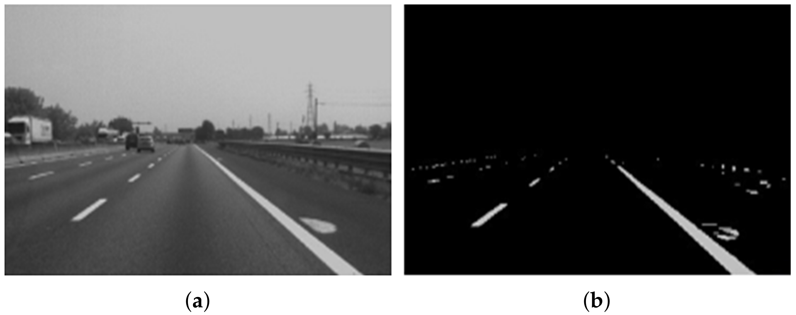

# ✏️ Drawing Contours

## Introduction

In computer vision, **contours** are curves that join all the continuous points along the boundary of an object with the same color or intensity. The mask of the HSV filtering output (refer previous section) is used to find these contours. We can then manipulate these contours to detect and measure objects in images.

Why do we care about contours in UMARV?  
- They help us **detect and outline obstacles** such as cones or barrels.  
- We can **measure shapes** (e.g., circular vs rectangular obstacles).  
- They form the basis for **object detection, localization, and tracking**.  

Think of contours as a way to let the robot “trace the outline” of an object it sees.

---

## Example: Finding Contours in an Image

The following code detects contours in an image and draws them on top of the original.

```python
import cv2

# 1. Convert the image to grayscale
#    Contour detection usually starts with a single-channel (grayscale) image
gray = cv2.cvtColor(img, cv2.COLOR_BGR2GRAY)

# 2. Apply a binary threshold
#    Any pixel value >127 becomes white (255), otherwise black (0)
#    This simplifies the image to just black & white
_, thresh = cv2.threshold(gray, 127, 255, cv2.THRESH_BINARY)

# 3. Find contours
#    - cv2.RETR_TREE → retrieves all contours and reconstructs full hierarchy
#    - cv2.CHAIN_APPROX_SIMPLE → compresses horizontal/vertical/diagonal segments
contours, _ = cv2.findContours(thresh, cv2.RETR_TREE, cv2.CHAIN_APPROX_SIMPLE)

# 4. Draw contours on the original image
#    -1 → draw all contours
#    (0, 255, 0) → green color in BGR
#    2 → thickness of the contour lines
cv2.drawContours(img, contours, -1, (0, 255, 0), 2)

# 5. Show result
cv2.imshow("Contours", img)
cv2.waitKey(0)
cv2.destroyAllWindows()
```

## Visual Examples
The contours are the white areas in the mask on the right. Each distinct shape is referred to as a contour by OpenCV. 



## Key Takeaways
* Contours take the shapes of objects in an image.

* They are useful for detecting and measuring obstacles like cones, barrels, or lane markers.

* Preprocessing steps (like grayscale conversion + thresholding) are crucial for good contour detection.

* Different cv2.findContours modes (e.g., RETR_TREE, RETR_EXTERNAL) control how contours are retrieved.

🔗[Contour Detection Example (OpenCV docs)](https://docs.opencv.org/4.x/d9/d8b/tutorial_py_contours.html)