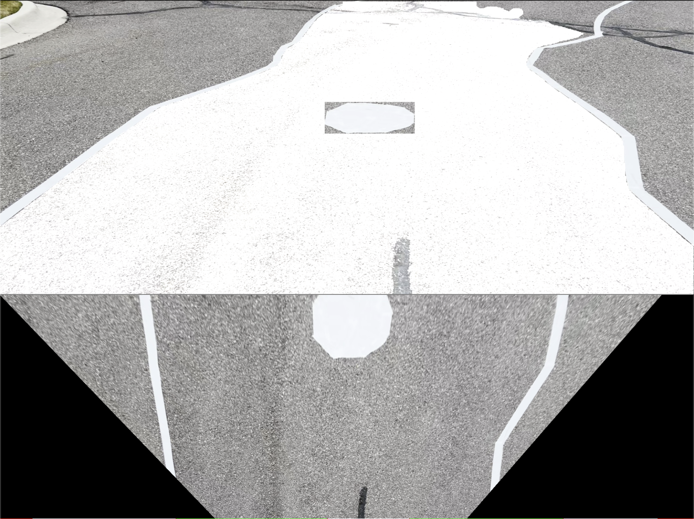
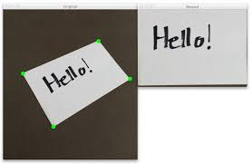
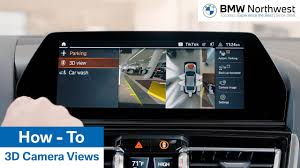

# 🌀 Perspective Transforms

## Introduction

In robotics, the camera often sees the world at an **angle** rather than from directly above.  
This creates a problem: objects closer to the camera look bigger, lane lines appear to converge, and measurements are distorted.  

**Perspective transforms** help us:  
- Convert a **front-facing view** into a **bird’s-eye (top-down) view**.  
- **Rectify skewed images**, like fixing a tilted sign or lane line.  
- Make **distance and shape measurements more accurate** for navigation.  

For UMARV, this is particularly useful for:  
- Creating a **top-down lane view** for path planning.  
- Aligning and rectifying camera input for more reliable obstacle detection.  

---

## Example: Bird’s-Eye View Transformation

```python
import cv2
import numpy as np

# 1. Define 4 source points (corners of the region in the original image)
#    Example: a square area in the image
pts1 = np.float32([[100, 100],   # top-left
                   [200, 100],   # top-right
                   [100, 200],   # bottom-left
                   [200, 200]])  # bottom-right

# 2. Define 4 destination points (where we want those corners to map to)
#    Here we map it to a perfect 300x300 square
pts2 = np.float32([[0, 0],       # top-left
                   [300, 0],     # top-right
                   [0, 300],     # bottom-left
                   [300, 300]])  # bottom-right

# 3. Compute the perspective transform matrix
matrix = cv2.getPerspectiveTransform(pts1, pts2)

# 4. Apply the warp (perform the transformation)
#    The output size is (300, 300)
output = cv2.warpPerspective(img, matrix, (300, 300))

# 5. Show the result
cv2.imshow("Original", img)
cv2.imshow("Warped (Top-Down View)", output)
cv2.waitKey(0)
cv2.destroyAllWindows()
```

## Visual Examples
**Real example** from our system: the upper segment is the original camera view, and the lower segment is the bird’s-eye view (BEV) after applying a perspective transform.







## Key Takeaways

* Perspective transforms let us change the viewpoint of an image.

* Commonly used for bird’s-eye views of lanes and rectifying tilted regions.

* Requires selecting four corner points in the original image and mapping them to a destination rectangle.

* Very useful in robotics for navigation, lane detection, and accurate geometric measurements.