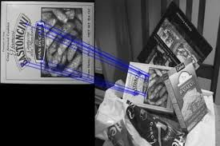
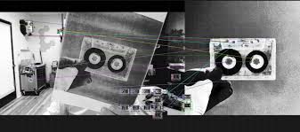

# 🔗 Feature Matching

## Introduction

Feature matching is the process of finding **keypoints** (distinctive patterns like corners, edges, or blobs) in two images and then matching them together.  

Why is this important for UMARV?  
- Our vehicle has **multiple cameras** that need to be stitched together into a **wider field of view**.  
- To stitch images, we need to find **common overlapping regions** between them.  
- Once matches are found, we can compute a **homography** and warp one image to align with the other.  

In short: feature matching is the **first step toward multi-camera image stitching**.  

---

## Example: ORB Feature Matching Between Two Images

We’ll use **ORB (Oriented FAST and Rotated BRIEF)** — a fast and efficient feature detector that works well in real-time systems like robotics.  

```python
import cv2

# 1. Load the two images (from two different cameras)
img1 = cv2.imread("cam1.jpg", cv2.IMREAD_GRAYSCALE)
img2 = cv2.imread("cam2.jpg", cv2.IMREAD_GRAYSCALE)

# 2. Initialize ORB detector
orb = cv2.ORB_create()

# 3. Find keypoints and descriptors
kp1, des1 = orb.detectAndCompute(img1, None)
kp2, des2 = orb.detectAndCompute(img2, None)

# 4. Create a Brute Force (BF) matcher with Hamming distance
bf = cv2.BFMatcher(cv2.NORM_HAMMING, crossCheck=True)

# 5. Match descriptors
matches = bf.match(des1, des2)

# 6. Sort matches by distance (best matches first)
matches = sorted(matches, key=lambda x: x.distance)

# 7. Draw the top matches
matched_img = cv2.drawMatches(img1, kp1, img2, kp2, matches[:20], None, flags=2)

# 8. Show the result
cv2.imshow("Feature Matches", matched_img)
cv2.waitKey(0)
cv2.destroyAllWindows()
```

## Visual Examples




## Key Takeaways

* Perspective transforms let us change the viewpoint of an image.

* Commonly used for bird’s-eye views of lanes and rectifying tilted regions.

* Requires selecting four corner points in the original image and mapping them to a destination rectangle.

* Very useful in robotics for navigation, lane detection, and accurate geometric measurements.