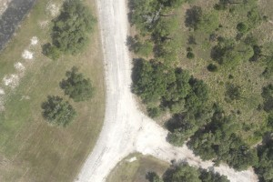
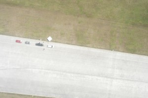
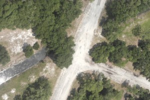
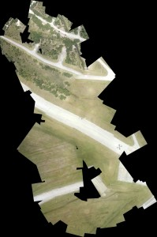

# 🖼️ Image Stitching with Homography

## Introduction

After finding **feature matches** between two camera images, the next step is to actually **combine them into a single stitched image**.  

This is done using a **homography**:  
- A homography is a mathematical transformation that maps points from one plane to another.  
- With matched feature points, we can estimate a homography matrix that aligns one image to the perspective of the other.  
- Once aligned, we can **warp** one image and **blend** it with the other, creating a larger field of view.  

For UMARV, this is critical for:  
- Combining **multiple camera feeds** into a single panoramic view.  
- Giving the robot a **wider perception range** for navigation and obstacle detection.  

---

## Example: Stitching Two Images

```python
import cv2
import numpy as np

# 1. Load the images
img1 = cv2.imread("cam1.jpg")
img2 = cv2.imread("cam2.jpg")

# Convert to grayscale for feature detection
gray1 = cv2.cvtColor(img1, cv2.COLOR_BGR2GRAY)
gray2 = cv2.cvtColor(img2, cv2.COLOR_BGR2GRAY)

# 2. Detect ORB features and compute descriptors
orb = cv2.ORB_create()
kp1, des1 = orb.detectAndCompute(gray1, None)
kp2, des2 = orb.detectAndCompute(gray2, None)

# 3. Match features using Brute Force matcher
bf = cv2.BFMatcher(cv2.NORM_HAMMING, crossCheck=True)
matches = bf.match(des1, des2)
matches = sorted(matches, key=lambda x: x.distance)

# 4. Extract location of good matches
pts1 = np.float32([kp1[m.queryIdx].pt for m in matches[:50]]).reshape(-1, 1, 2)
pts2 = np.float32([kp2[m.trainIdx].pt for m in matches[:50]]).reshape(-1, 1, 2)

# 5. Find homography matrix
H, _ = cv2.findHomography(pts1, pts2, cv2.RANSAC)

# 6. Warp img1 to align with img2
height, width, _ = img2.shape
result = cv2.warpPerspective(img1, H, (width + img1.shape[1], height))

# 7. Place img2 into the stitched result
result[0:height, 0:width] = img2

# 8. Show the stitched panorama
cv2.imshow("Stitched Image", result)
cv2.waitKey(0)
cv2.destroyAllWindows()
```

## Examples

Someone attempted to build their own stitcher here: [Link](https://gallinazo.flightgear.org/software/adventures-in-aerial-image-stitching/)







Stitched map from the multiple images captured on their drone:



## Key Takeaways

* Feature matching gives us the points in common between two images.

* Homography allows us to align one image to another using those points.

* By warping and blending, we can create a stitched panoramic view.

* This technique is essential for UMARV to combine multi-camera input into a single coherent view.
