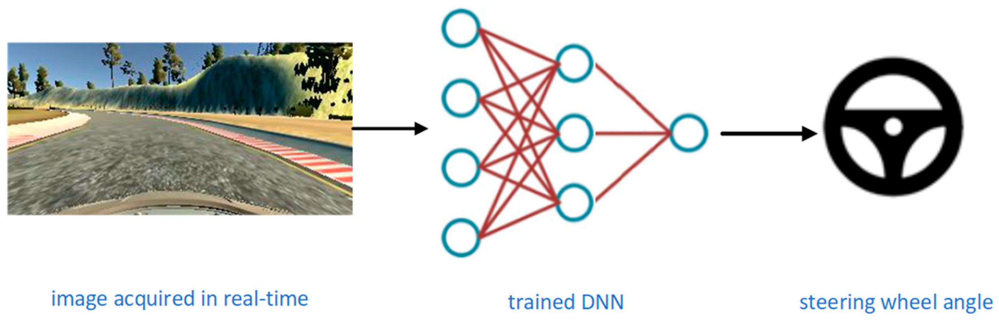
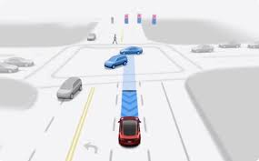
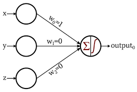
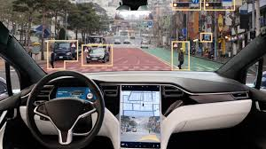
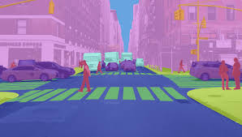
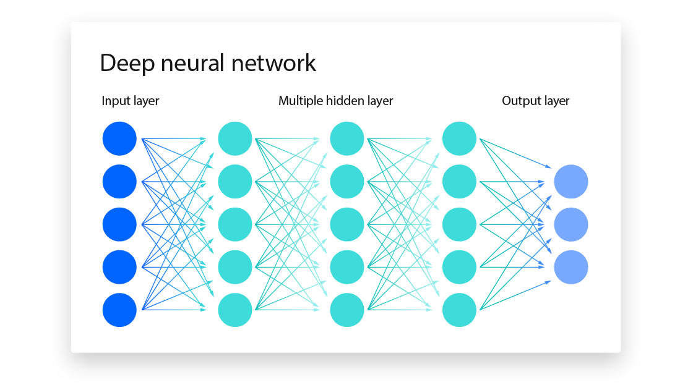
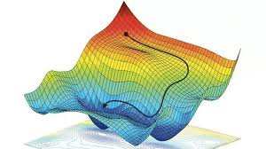

# 📚 Machine Learning Theory for UMARV

This section gives you the **basics** of machine learning, explained with examples.

---

## 🧭 1. Learning Modes in Machine Learning

### **Supervised Learning**
- **Definition**: The model learns from labeled data — every input comes with the correct output.
- **Example**: Given camera images (input) and the corresponding steering angles from human drivers (output), the model learns to predict steering angles.

### **Unsupervised Learning**
- **Definition**: The model finds patterns in data without explicit labels.
- **Example**: Grouping similar driving conditions from LiDAR point clouds without telling the model what each cluster represents.

---

## ⚙️ 2. Basic Building Block – The Perceptron
- **What it is**: The simplest type of artificial neuron.
- **How it works**:
  1. Takes inputs (e.g., sensor readings)
  2. Multiplies them by weights
  3. Adds a bias
  4. Passes the sum through an activation function (like a decision gate)
- **Example**: A perceptron could decide whether the car should brake based on the distance to the object ahead.

---

## 🧠 3. What is Deep Learning?
- **Definition**: Machine learning using **neural networks** with multiple layers (“deep” means many layers).
- **Why it matters for ARV**:
  - Multiple layers help detect increasingly complex features.
    - Layer 1: detects edges in images
    - Layer 2: detects wheels or pedestrians
    - Layer 3: detects entire vehicles or lane lines

---

## 🎯 4. Common ML Tasks in ARV

### **Object Detection**
- Finding and classifying objects in an image.
- **Example**: Detecting pedestrians, vehicle, and traffic cones in a given frame.

### **Segmentation**
- Classifying **each pixel** in an image.
- **Example**: Lane segmentation to separate road, lane markings, and obstacles in the camera feed.

---

## 🕸 5. Neural Networks
- **Structure**: Layers of connected “neurons.”
- **Types relevant to our work**:
  - **Fully connected networks** – General sensor fusion tasks.
  - **Convolutional Neural Networks (CNNs)** – Image-based tasks like object detection and lane following.
  - **Recurrent Neural Networks (RNNs) / LSTMs** – Predicting future positions based on sequential GPS readings.

**EXCELLENT** videos to understand the working of neural networks!
-  [StatQuest's Neural Networks](https://www.youtube.com/watch?v=CqOfi41LfDw)
- [How to Make a Neural Network](https://www.youtube.com/watch?v=wieryfWkOl0)

  

---

## 🔄 6. Backpropagation – How Models Learn
- **Definition**: The algorithm that adjusts the weights of a neural network to reduce errors.
- **Steps**:
  1. **Forward pass**: Make predictions.
  2. **Loss calculation**: Measure how wrong the predictions were.
  3. **Backward pass**: Calculate how each weight contributed to the error.
  4. **Update**: Adjust weights using an optimizer (e.g., SGD or Adam).
- 🚲 **Analogy**: Learning to Ride a Bike

  - *Forward pass* = you try riding the bike down the street.

  - *Loss* = how wobbly or far you fell from balance.

  - *Backward pass* = thinking back on why you lost balance (leaned too much left, pedaled too slowly, etc.).

  - *Update* = adjusting your balance, speed, or pedaling the next time.

- Backpropagation is just like practicing biking: each attempt gives feedback about your mistakes, and with repeated small adjustments, you get steadily better.
---

## 📉 7. Gradient Descent – The Path to Better Models
- **Definition**: An optimization algorithm that finds the set of weights that minimize the loss function by taking small steps in the direction of steepest descent.
- **How it works**:
  1. Start with random weights.
  2. Compute the gradient (direction of steepest increase in loss).
  3. Move in the *opposite* direction to reduce the loss.
  4. Repeat until the loss is small enough.
- **Key term**: **Learning rate** – how big each step is. Too big → overshoot; too small → very slow learning.
- **ARV Example**:  
  Imagine fine-tuning the car’s steering control:  
  - Start with random steering rules (terrible driving).  
  - Measure how bad they are (loss).  
  - Adjust the rules slightly (gradient step).  
  - Repeat until the car drives smoothly.
- **Formula**:  
``weight_new = weight_old - learning_rate × gradient``

💡 **Key takeaway for UMARV members**:  
Machine learning is about **finding patterns from data** so our vehicle can make better driving decisions. Whether supervised or unsupervised, simple perceptrons or deep neural networks, the goal is the same — safer, smarter autonomy.
