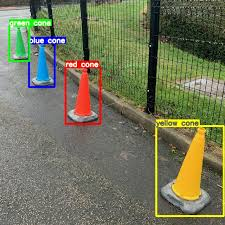

# 🐆 YOLO (You Only Look Once)

YOLO is one of the most popular object detection models. Unlike traditional methods that scan an image many times, YOLO looks at the image once and directly predicts:

* Bounding boxes (where objects are)

* Class labels (what the objects are)

This makes YOLO fast and accurate, ideal for robotics tasks like:

* Detecting traffic cones, lane markings, pedestrians, vehicles

* Understanding surroundings in real-time for autonomous navigation

We’ll use the modern Ultralytics YOLO library, which makes training and inference very straightforward.

## ⚙️ Installation
To get started with YOLO, you need to install the Ultralytics library. This can be done easily using pip:

```bash
pip install ultralytics
```

## 📸 Running YOLO on an Image

This is the simplest way to use YOLO: load a pre-trained model and run it on an image.

```python
from ultralytics import YOLO

# Load a pretrained YOLOv8 model (trained on COCO dataset with 80 classes)
model = YOLO("yolov8n.pt")   # 'n' = nano (small & fast)

# Run inference on an image
results = model("cones.jpg")

# Show the results (with bounding boxes and labels)
results.show()

```


➡️ This will open a window showing detections (e.g., cones, people, cars).

## 🎥 Running YOLO on Video / Webcam

Autonomous robots often need to detect objects in real-time.
This snippet runs YOLO on your webcam feed:

```python
from ultralytics import YOLO

model = YOLO("yolov8n.pt")

# Run inference on webcam (device=0 means default camera)
model.predict(source=0, show=True)
```


➡️ You’ll see bounding boxes live on your camera feed!

## 🛠️ Training YOLO on Custom Data

For UMARV, we may want to detect custom obstacles (e.g., different cone colors, lane lines, barrels).
We can fine-tune YOLO on our own dataset.

```python
from ultralytics import YOLO

# Load a pretrained YOLO model
model = YOLO("yolov8n.pt")

# Train on a custom dataset
model.train(
    data="dataset.yaml",   # defines paths to images + classes
    epochs=50,             # how many training cycles
    imgsz=640              # image size
)

```

➡️ After training, YOLO will be specialized for our obstacles.

## 📊 Understanding Results

After detection, YOLO gives you structured outputs:

```python
results = model("cones.jpg")

for r in results:
    boxes = r.boxes  # bounding boxes
    for box in boxes:
        print("Coordinates:", box.xyxy)  # [x1, y1, x2, y2]
        print("Class:", box.cls)         # class id
        print("Confidence:", box.conf)   # confidence score
```

➡️ This is useful if we want to filter results (e.g., only care about cones, ignore cars).

## Visual Examples


## 🔑 Key Takeaways

* YOLO = fast, accurate object detection in one pass.

* Easy to run with Ultralytics (just a few lines of code).

* Works on images, video, and custom datasets.

* Perfect for real-time robotics tasks.