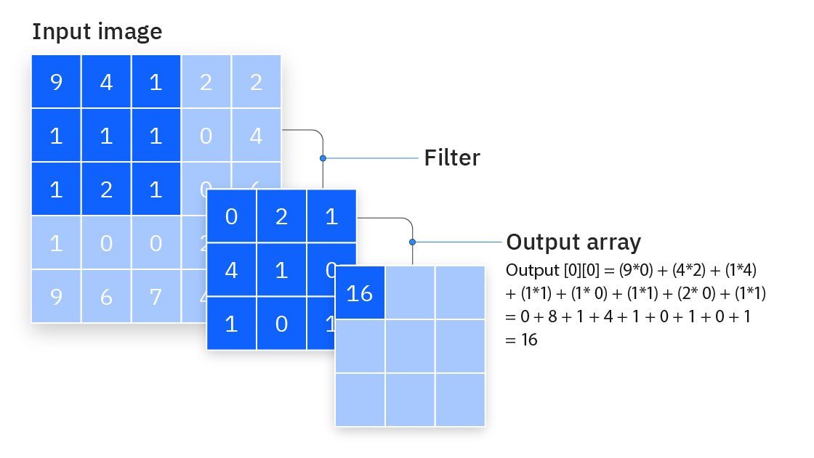
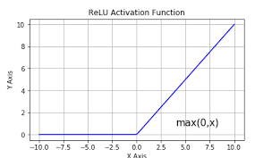
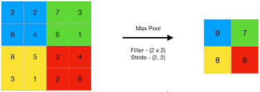
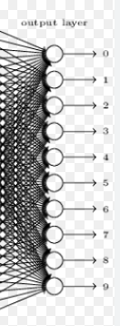

# 🧠 Convolutional Neural Networks (CNNs)

Convolutional Neural Networks (CNNs) are a type of deep learning model designed to **process visual data** like images and video.  
They are the foundation of many computer vision tasks in ARV projects: detecting lanes, recognizing obstacles, and analyzing camera feeds.

---

## 🔍 Why CNNs?

In traditional neural networks, every neuron is connected to every input pixel — this becomes inefficient for images.  
CNNs solve this by using **convolutions**:

- 🖼️ **Look at local regions** (small patches of the image) rather than the whole image at once.
- ♻️ **Reuse filters (kernels)** across the image, drastically reducing the number of parameters.
- 👀 Automatically learn **features** like edges, textures, and shapes.

For our ARV projects:
- CNNs can process the **camera frame** stored in `self.frame`.
- They are efficient for tasks like **object detection** (via YOLO) and **semantic segmentation** (road/obstacle masks).

---

## 🧱 Core Building Blocks

**AMAZING** video to visualize CNNs: [Video by Futurology](https://www.youtube.com/watch?v=pj9-rr1wDhM)
- Watch starting from 1:25  

### 1. Convolution Layer
Extracts features using **filters/kernels**.



```python
import torch
import torch.nn as nn

conv = nn.Conv2d(in_channels=3, out_channels=16, kernel_size=3, stride=1, padding=1)
```

`in_channels`=3 → RGB image

`out_channels`=16 → number of filters (features learned)

`kernel_size`=3 → 3x3 filter

### 2. Activation Function

Introduces non-linearity (lets the model learn complex patterns). In the image below, the values from the convolution layer are passed through ReLU (Rectified Linear Unit), which sets negative values to zero.



```python
relu = nn.ReLU()
```

### 3. Pooling Layer
Downsamples the feature map to reduce size and computation.



```python
pool = nn.MaxPool2d(kernel_size=2, stride=2)
```

* Picks the maximum value in each 2x2 region.

* Helps keep the most important features.

### 4. Fully Connected Layer

At the end, CNNs use dense layers to make predictions.



```python
fc = nn.Linear(16*8*8, 10)  # Example: 10 classes
```

## 🏗️ Putting It Together: A Mini CNN

Here’s a simple CNN for image classification:

```python
class SimpleCNN(nn.Module):
    def __init__(self):
        super(SimpleCNN, self).__init__()
        self.conv1 = nn.Conv2d(3, 16, 3, 1, 1)  # Conv layer
        self.pool = nn.MaxPool2d(2, 2)          # Pooling layer
        self.relu = nn.ReLU()                   # Activation
        self.fc1 = nn.Linear(16*16*16, 10)      # Fully connected

    def forward(self, x):
        x = self.relu(self.conv1(x))   # Conv + ReLU
        x = self.pool(x)               # Pooling
        x = x.view(-1, 16*16*16)       # Flatten
        x = self.fc1(x)                # Fully connected
        return x
```
---
### 🚗 How CNNs Connect to ARV

**Object Detection:** CNNs are the backbone of YOLO, which we already covered.

**Segmentation:** Detecting drivable area vs obstacles.

**Sensor Fusion:** Combine camera input with LiDAR data (stored in self.occ_grid).

CNNs give us the **eyes of the ARV**, helping it interpret the environment from visual data.